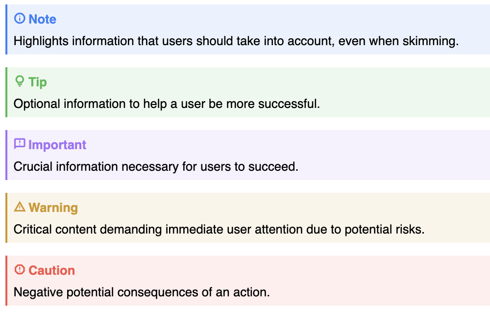

# callout-alert

A Github / Obsidian inspired web component for displaying a callout in your
page.

<a href="https://codepen.io/JRJurman/pen/ZEPpKZg"></a>

[Live Example on Codepen](https://codepen.io/JRJurman/pen/ZEPpKZg)

## How to use

```html
<script src="https://unpkg.com/callout-alert@1"></script>

<callout-alert type="tip">
  Optional information to help a user be more successful.
</callout-alert>
```

## Types of Alerts

The following types are available by default:

| type        | color  | icon             | title     |
| ----------- | ------ | ---------------- | --------- |
| `note`      | blue   | info circle      | Note      |
| `tip`       | green  | lightbulb        | Tip       |
| `important` | purple | report comment   | Important |
| `warning`   | yellow | warning triangle | Warning   |
| `caution`   | red    | report octogon   | Caution   |
| Default     | grey   | document icon    | Note      |

You can also configure the Color, Icon, and Title using CSS variables or slots.

### CSS API

The following CSS variables can be used to control the presentation of the
component:

<dl>
<dt>--callout-color</dt>
<dd>
	Used to set the color of the component. Currently must be a set of 3 numbers,
	the red, green, and blue value.
</dd>

<dt>--callout-icon</dt>
<dd>
	Icon to use, you can use any value from
	<a href="https://fonts.google.com/icons">Google's Icon Font</a>.
</dd>

<dt>--callout-title</dt>
<dd>
	Title for the callout. Can be any string.
</dd>
</dl>

You can set some or all of these for a specific `callout-alert` instance, or at
a page level.

```html
<style>
  callout-alert {
    --callout-color: 0, 200, 225;
    --callout-icon: 'bolt';
    --callout-title: 'Alert';
  }
</style>

<callout-alert> Watch out for Lightning bolts! </callout-alert>
```

### Slot API

You can use the following slot names to change the icon or title of the callout.

<dl>
<dt>icon</dt>
<dd>
	Can be used to override the icon.
</dd>

<dt>title</dt>
<dd>
	Can be used to override the title.
</dd>
</dl>

You can set some or all of these inside a `callout-alert` instance.

```html
<callout-alert type="tip">
  <span slot="icon">📦</span>
  <span slot="title">Slots</span>
  This is a custom alert, that uses slots to set the icon and title.
</callout-alert>
```

## Known Limitations

Below are a list of known limitations. While there may be available solutions
here, an effort has been made to make the code as straight-forward as possible.

### Colors

Until relative CSS colors are universally supported, the colors are defined as
three numbers. Ideally, once relative colors are supported, we would allow any
CSS color (this will be marked as a breaking change, if introduced).

### Icon Library

By default, this component loads Google's Material Icon font in the owner
document using javascript. Sadly, it's currently not possible to load
font-families from a web component context, or from a stylesheet in a component.

## Development

This component was built using Tram-Lite, you can read more about the project at
[https://tram-one.io/tram-lite/](https://tram-one.io/tram-lite/).

You can load the source file locally in an HTML file by including the following 
script tag:
```html
<script src="https://unpkg.com/tram-lite@5/output/import-components.js" tl-components="./callout-alert.html"></script>
```

Alternatively, you can build the project locally by running the following:
```sh
npm ci
npm run build
```
